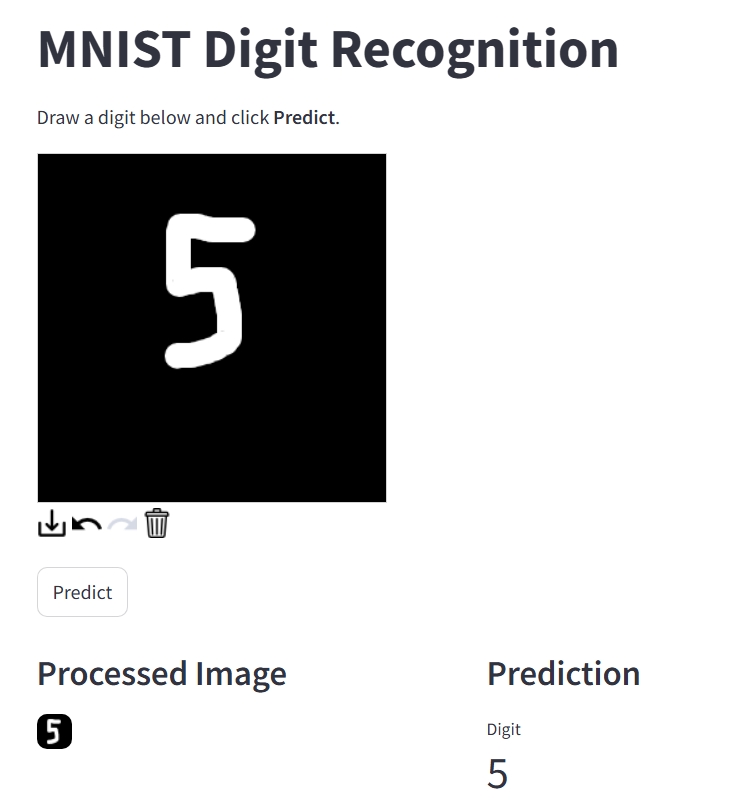

# Digit Recognition

An interactive handwritten digit recognition web app built with **TensorFlow**, **OpenCV**, and **Streamlit**. Users can draw a digit on a canvas, and a Convolutional Neural Network (CNN) trained on the MNIST dataset predicts the digit in real time, made for the sole Purpose of Training.

## Demo

<p align="center">
  
</p>

---

## Features

-  Interactive drawing canvas
-  CNN trained on the MNIST dataset
-  Real-time digit prediction
-  Prediction confidence visualization
-  Automatic preprocessing to match MNIST formatting
---

## Installation

Clone the repository:

```bash
git clone https://github.com/AboMedoz/Digit-Recognition.git
cd Digit-Recognition
```

Install the dependencies:

```bash
pip install -r requirements.txt
```

---

## Training

Train the model using:

```bash
python ./src/modeling/model_training.py
```

The trained model will be saved as:

```
models/digit_recognition.keras
```

---

## Running the Application

Start the Streamlit app:

```bash
streamlit run app.py
```

Open your browser and navigate to:

```
http://localhost:8501
```

---

## Results

The model achieves approximately **99% test accuracy** on the MNIST dataset and performs well on hand-drawn digits after preprocessing.

---

## Future Improvements

- Predict Mulitple Digits
---

## License

This project is licensed under the MIT License.

---
